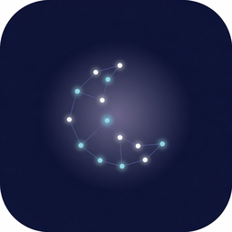

# AstroSleep Android

<p align="center">
  
</p>

Native Android port of AstroSleep (Kotlin + Jetpack Compose).  
iOS source of truth: `../AstroSleep-iOS/` · plan: `../documentation/ANDROID_PORT_PLAN.md`

## Status

**Core port + TagEngine v4 + critical bugfixes + CI landed.** See root [README.md](../README.md), [BUGFIX_SPRINT_NOTES.md](../documentation/BUGFIX_SPRINT_NOTES.md), and [`.agents/reviews/STATUS.md`](../.agents/reviews/STATUS.md).

| Area | Status |
|------|--------|
| TagEngine v4 + ComboComposer | ✅ personalized stacks |
| AstrologicalEngine | ✅ 13-sign, birth time, moon epoch, full UTC JD |
| ElementVector presets | ✅ |
| Room + StorageRepository | ✅ |
| SoundLibrary (manifest + CDN cache) | ✅ |
| AppViewModel (score, combo, session) | ✅ |
| AudioService + PlaybackService FGS | ✅ MediaStyle / MediaSession |
| Per-layer system Equalizer | ✅ |
| Affirmations + `user_id` API | ✅ |
| Geocoding | ✅ |
| Bedtime notifications + boot reschedule | ✅ |
| Library (save / play / delete) | ✅ Room UX |
| Compose UI (onboarding → tabs + Cosmic) | ✅ Digital Sea |
| RevenueCat / Network / Auth shells | 🟡 production keys + full Supabase still open |
| Bundled `.m4a` assets | ⏳ (CDN/manifest) |
| CI unit tests | ✅ GitHub Actions on `main` |

## Open in Android Studio

1. Install [Android Studio](https://developer.android.com/studio) + SDK 35
2. **File → Open** → `AstroSleep-Android/`
3. Let Gradle sync (Studio will offer to install the Gradle wrapper if missing)
4. Create `local.properties` (Studio usually auto-writes `sdk.dir`):

```properties
sdk.dir=C\:\\Users\\YOU\\AppData\\Local\\Android\\Sdk
SUPABASE_URL=https://your-project.supabase.co
SUPABASE_ANON_KEY=
REVENUECAT_API_KEY=
# optional overrides:
# PROXY_BASE_URL=https://api.astrosleep.app/api
# SOUND_MANIFEST_URL=https://cdn.astrosleep.app/sounds_manifest.json
```

5. Run on emulator or device (`app` configuration)

## First build without Studio

Once `sdk.dir` is set and the Gradle wrapper exists:

```bash
./gradlew :app:assembleDebug
./gradlew :app:testDebugUnitTest
```

If the wrapper is missing, open the project once in Android Studio or run `gradle wrapper` with a local Gradle 8.9+ install.

CI runs the same unit-test task on every push/PR (`.github/workflows/ci.yml`).

## Package map

| Path | Role |
|------|------|
| `core/model` | ElementVector, Sound, UserProfile, Combo |
| `core/engine` | TagEngine v4, ComboComposer, AstrologicalEngine |
| `core/config` | AppConfig / BuildConfig secrets |
| `service/` | Audio, Auth, Network, RC, notifications, geocode |
| `ui/` | Compose screens (Tonight, Sounds, Library, Cosmos, Settings, …) |
| `data/` | Room + StorageRepository |
| `assets/sounds/` | Manifest (+ optional m4a) |
| `assets/cosmic-systems/` | Bundled 3D sky (synced from `shared/`) |

## Lockstep with iOS

After editing shared assets or the iOS sound manifest (source of truth):

```bash
# from repo root
python tools/sync_shared.py
python tools/check_parity.py
```

Tag-dimension weights and cosmic-systems bytes must match iOS — CI fails on drift.

## Security

- Birth data stays on device (Room only) — never upload
- Secrets via `local.properties` / CI → `BuildConfig`, not source
- HTTPS only (`usesCleartextTraffic=false`)
