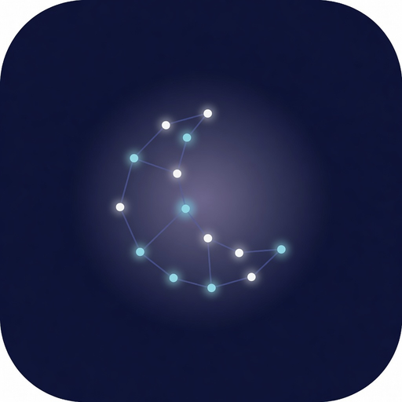

# AstroSleep

<p align="center">
  
</p>

<p align="center"><strong>Personalized sleep soundscapes driven by your natal chart, tonight’s sky, and a 12-dimensional sound tag engine.</strong></p>

<p align="center"><a href="https://github.com/nuroctane/ASTROSleep/actions/workflows/ci.yml"></a></p>

**Aesthetic:** quiet night, not casino. Deep void field, glass surfaces, indigo + biolume accents (Digital Sea). Birth data stays on device. Restrained motion.

AstroSleep is a dual-platform native app (iOS + Android) that:

1. Computes a **sidereal 13-sign natal chart** (Sharatan ayanamsha) from birth data that **never leaves the device**
2. Scores **tonight’s transits + moon phase** into a Fire / Earth / Air / Water vector
3. Ranks ambient sounds via a **12-dimensional tag engine** and builds multi-layer combos
4. Plays **looping multi-track audio** (EQ, LFO, sleep timer, TTS affirmations)
5. Optionally fetches **AI affirmations** through a controlled proxy (rate-limited, no birth data)

| Platform | Stack | Path |
|----------|--------|------|
| **iOS** | SwiftUI · MVVM · AVFoundation · Core Data · **Liquid Glass (iOS 26)** | [`AstroSleep-iOS/`](AstroSleep-iOS/) |
| **Android** | Kotlin · Jetpack Compose · Media3 · Room · Hilt | [`AstroSleep-Android/`](AstroSleep-Android/) |

**Repo:** [github.com/nuroctane/ASTROSleep](https://github.com/nuroctane/ASTROSleep)  
**Brand:** Constellation Field mark — see [`branding/`](branding/) · design tokens [`.agents/DESIGN.md`](.agents/DESIGN.md)

---

## Table of contents

- [Product overview](#product-overview)
- [Repository layout](#repository-layout)
- [How the engines work](#how-the-engines-work)
- [Platform status](#platform-status)
- [Quick start — Android](#quick-start--android)
- [Quick start — iOS](#quick-start--ios)
- [Configuration & secrets](#configuration--secrets)
- [Sound catalog](#sound-catalog)
- [Security & privacy](#security--privacy)
- [Subscriptions](#subscriptions)
- [Testing](#testing)
- [Documentation index](#documentation-index)
- [Roadmap](#roadmap)
- [License](#license)

---

## Product overview

### Core loop

```
Onboarding (birth data)
        │  local only — Core Data / Room
        ▼
Natal chart + base ElementVector
        │
        ▼
Nightly score (transits + moon phase)
        │
        ▼
Tag engine ranks sounds ──► Combo composer stacks layers
        │
        ▼
Playback (multi-track ambient + optional TTS affirmation)
```

### Features

| Feature | Description |
|---------|-------------|
| **Natal chart** | Sidereal 13-sign zodiac (includes Ophiuchus), Sharatan ayanamsha, equal-house when birth time known |
| **Nightly score** | Moon phase + transit aspects → elemental blend for *tonight* |
| **Tag engine** | 12 dimensions (domain, rhythm, register, context, weight, texture, motion, density, temperature, polarity, celestial, archetype) |
| **Personalized stacks (v4)** | Per-user fingerprint, natal/transit/phase affinities, role-based layer seats (bedrock → spark) on **iOS + Android** |
| **Multi-layer audio** | Per-layer volume, speed, EQ, LFO oscillation, sleep-timer fade |
| **Affirmations** | Cached daily scripts via HTTPS proxy; on-device TTS |
| **Library** | Saved combos / session history |
| **Cosmic Systems** | Interactive 3D sky (shared Three.js assets) — see docs |
| **Subscriptions** | Free / Subscription / Lifetime (RevenueCat — production wiring in progress) |

### Design principles

- **Birth data stays on device** — never uploaded, not sent to analytics
- **Secrets out of source** — xcconfig / `local.properties` / CI only
- **HTTPS only** in production network paths
- **Deterministic chart math** — no randomness in rulerships or scoring seeds (user fingerprint is hash-stable)
- **Digital Sea optical identity** — void navy, glass, accent `#5856D6`, biolume `#5AC8FA`; no neon chrome

---

## Repository layout

```
ASTROSleep/
├── README.md                          ← you are here
├── branding/                          # Constellation Field logo masters
│   ├── astrosleep-logo.png            # 1024 master
│   └── README.md
├── .agents/
│   └── DESIGN.md                      # Digital Sea design system (agent SoT)
├── .gitignore
├── AstroSleep-iOS/                    # Native iOS app
│   ├── AstroSleep/                    # Swift sources, Core Data, entitlements
│   │   └── Resources/
│   │       ├── Assets.xcassets        # AppIcon + Logo imageset
│   │       └── cosmic-systems/        # Bundled 3D sky (iOS target)
│   └── Sounds/                        # sounds_manifest.json + validate_manifest.py
├── AstroSleep-Android/                # Native Android app
│   ├── app/                           # Gradle module (Compose UI, engines, services)
│   │   └── src/main/
│   │       ├── res/                   # Launcher icons + logo drawable
│   │       └── assets/cosmic-systems/ # Bundled 3D sky
│   ├── gradle/
│   └── README.md
├── shared/
│   └── cosmic-systems/                # Source Three.js sky (copy into platforms)
├── documentation/                     # Specs, guides, checklists
├── testing/
│   └── astrosleep-preview/            # HTML preview / experimental UI
```

---

## How the engines work

### Astrological engine

- **Zodiac:** Sidereal, **13 signs** (equal sectors of `360°/13` for simplified model)
- **Ayanamsha:** Sharatan (≈ 24°06′18″)
- **Houses:** Equal system when birth time is known (ascendant = 1st cusp)
- **Output:** Natal placements, base `ElementVector`, nightly score + active transits + moon phase

> Production astronomy can later swap in Swiss Ephemeris; the current model is intentional simplified math shared by both apps for ranking consistency.

### Tag engine (12 dimensions)

Every sound is tagged on axes such as **domain** (water/fire/…), **celestial** (lunar/solar/…), **archetype** (mother/hero/…), etc. Weighted lookup tables map tags → elemental vectors. Nightly (and natal + transit + fingerprint) scores rank the catalog.

| Weight | Dimensions |
|--------|------------|
| **9×** | `domain` |
| **4×** | `celestial`, `archetype` |
| **3×** | `rhythm`, `motion` |
| **2×** | register, context, weight, texture, density, temperature, polarity |

- **Both platforms:** Tag Engine **v4** — personal sound profile, multi-factor scoring, role-based `ComboComposer`. Keep iOS/Android scoring in lockstep (see [`documentation/TAG_ENGINE_ANDROID_V4.md`](documentation/TAG_ENGINE_ANDROID_V4.md), [`documentation/TAG_ENGINE_IOS_V4_PORT.md`](documentation/TAG_ENGINE_IOS_V4_PORT.md)).

### Element vector

`[Fire, Earth, Air, Water]` with normalize-to-peak, sign/house/phase/transit presets. Used for natal base score, nightly blend, and sound matching.

---

## Platform status

| Area | iOS | Android |
|------|-----|---------|
| Onboarding + local profile | ✅ | ✅ |
| Natal + nightly engines | ✅ | ✅ |
| Tag ranking | ✅ **v4** personalization | ✅ **v4** personalization |
| Multi-track playback + loop | ✅ | ✅ (ExoPlayer repeat) |
| Sleep timer fade | ✅ | ✅ |
| Background audio | ✅ (AV session) | ✅ FGS shell (`PlaybackService`) |
| TTS affirmations | ✅ | ✅ |
| AI affirmation network | ✅ | ✅ |
| Auth (Supabase) | ✅ (+ Apple Sign-In path) | 🟡 local anonymous shell (email identity) |
| RevenueCat production | 🟡 DEBUG stub gated | 🟡 SDK shell |
| Sound assets in-repo | Manifest only | Manifest only (CDN/bundle + **cache pipeline**) |
| Per-layer EQ | ✅ AVAudioUnitEQ | ✅ system Equalizer |
| Library / saved combos | ✅ | ✅ Room UX |
| Bedtime notifications | ✅ | ✅ + boot reschedule |
| Geocoding | ✅ | ✅ |
| Cosmic Systems 3D tab | ✅ (WebView + shared assets) | ✅ (WebView + shared assets) |
| Unit tests | Limited (Swift / no Xcodeproj in repo) | ✅ engines + personalization + fingerprint golden |

Detailed recent fixes: [`documentation/BUGFIX_SPRINT_NOTES.md`](documentation/BUGFIX_SPRINT_NOTES.md)

---

## Quick start — Android

### Requirements

- Android Studio (recent stable) **or** JDK 17+ and Android SDK 35
- OpenJDK 17+ (project targets JVM 17)

### Open & run

```bash
# Clone
git clone https://github.com/nuroctane/ASTROSleep.git
cd ASTROSleep/AstroSleep-Android
```

1. Open `AstroSleep-Android/` in Android Studio → sync Gradle  
2. Ensure `local.properties` has `sdk.dir=...` (Studio writes this)  
3. Optionally add secrets (see [Configuration](#configuration--secrets))  
4. Run **app** on emulator or device  

CLI:

```bash
./gradlew :app:assembleDebug
./gradlew :app:testDebugUnitTest
```

On Windows: `gradlew.bat :app:testDebugUnitTest`

Package id: `com.astrosleep.app` · minSdk 26 · target/compile SDK 35

More detail: [`AstroSleep-Android/README.md`](AstroSleep-Android/README.md)

---

## Quick start — iOS

### Requirements

- Xcode with current App Store SDK requirements (see iOS README for iOS 26 SDK notes)
- Apple Developer team for device / capabilities

### Setup

1. Create or open an Xcode iOS App project (`com.astrosleep`)  
2. Add sources from `AstroSleep-iOS/AstroSleep/`  
3. Add Core Data model, entitlements, `PrivacyInfo.xcprivacy`  
4. SPM packages (as needed): RevenueCat, Supabase, PostHog, Sentry  
5. Capabilities: **Background Audio**, Push, Sign in with Apple, Associated Domains  
6. Inject secrets via xcconfig / User-Defined Build Settings  
7. Bundle `cosmic-systems` assets (see [`documentation/XCODE_COSMIC_BUNDLE.md`](documentation/XCODE_COSMIC_BUNDLE.md))

Full setup, App Store checklist, and security list:

- [`documentation/AstroSleep-iOS_README.md`](documentation/AstroSleep-iOS_README.md)  
- [`documentation/iOS_GO_LIVE_CHECKLIST.md`](documentation/iOS_GO_LIVE_CHECKLIST.md)

---

## Configuration & secrets

**Never commit API keys.** Both apps read config from environment / build injection.

| Key | Purpose | Default / notes |
|-----|---------|-----------------|
| `SUPABASE_URL` | Auth backend | Required for real auth |
| `SUPABASE_ANON_KEY` | Supabase anon key | Required for real auth |
| `REVENUECAT_API_KEY` | Subscriptions | Public SDK key |
| `PROXY_BASE_URL` | AI affirmation proxy | `https://api.astrosleep.app/api` |
| `SOUND_MANIFEST_URL` | Remote catalog | `https://cdn.astrosleep.app/sounds_manifest.json` |

### Android

Copy [`AstroSleep-Android/local.properties.example`](AstroSleep-Android/local.properties.example) → `local.properties` (gitignored):

```properties
sdk.dir=C\:\\Users\\YOU\\AppData\\Local\\Android\\Sdk
SUPABASE_URL=https://your-project.supabase.co
SUPABASE_ANON_KEY=
REVENUECAT_API_KEY=
```

Values are injected into `BuildConfig` via `app/build.gradle.kts`.

### iOS

Use `AstroSleep.xcconfig` or Xcode User-Defined settings + Info.plist placeholders:

```
SUPABASE_URL = https://your-project.supabase.co
SUPABASE_ANON_KEY = ...
REVENUECAT_API_KEY = ...
```

Central readers: `AppConfig.swift` / `AppConfig.kt`.

---

## Sound catalog

- Manifest: `AstroSleep-iOS/Sounds/sounds_manifest.json` (copied into Android `app/src/main/assets/sounds/`)
- Schema & tags: [`documentation/Sounds_README.md`](documentation/Sounds_README.md)
- Validation: `python AstroSleep-iOS/Sounds/validate_manifest.py`

**Resolution order at runtime:**

1. App bundle / assets (`bundleFilename`)  
2. Local download cache  
3. CDN URL from manifest  

> The repo may ship **manifest only** without large `.m4a` binaries. For offline demos, place files next to the manifest and keep `bundleFilename` in sync.

---

## Security & privacy

| Control | Status |
|---------|--------|
| Birth data local-only (Core Data / Room) | ✅ design requirement |
| Auth tokens Keychain / EncryptedSharedPreferences | ✅ |
| No secrets in git | ✅ (`.gitignore` + build injection) |
| HTTPS / cleartext disabled | ✅ |
| AI proxy rate limit + controlled system prompt | ✅ (server-side) |
| Analytics without birth/geo PII | ✅ policy |
| iOS RevenueCat purchase simulation | **DEBUG builds only** |
| Generative AI App Store disclosure | Required for iOS shipping |

**Do not** claim medical treatment of insomnia/anxiety in store copy — position as sleep wellness / mindfulness.

---

## Subscriptions

Tiers (code model):

| Tier | Layers (typical) | Notes |
|------|------------------|--------|
| Free | 2 | Session history limited |
| Subscription | 7 | Paid recurring |
| Lifetime / Pro | 7 | One-time unlock |

Wire products in App Store Connect / Play Console and map entitlements in RevenueCat (`lifetime` / `pro` / `subscription` / `basic` keys as implemented per platform).

---

## Testing

### Android (primary automated suite)

```bash
cd AstroSleep-Android
./gradlew :app:testDebugUnitTest
```

Covers:

- `ElementVector` arithmetic  
- `AstrologicalEngine` (JD, moon phase, 13-sign coverage, birth time → ascendant)  
- `TagEngine` + **personalization** (different charts/users → different stacks)  

### iOS

- Prefer physical device for **background audio** soak (30+ min, screen locked)  
- See go-live checklist for interruption, timer fade, restore purchases  

### Manifest

```bash
python AstroSleep-iOS/Sounds/validate_manifest.py
```

### Cross-platform parity (drift guard)

The lockstep rules (shared `cosmic-systems` copies, duplicated sound manifest,
identical tag-dimension weights across Swift / Kotlin / Python, exactly one
iOS privacy manifest + entitlements) are executable, not honor-system:

```bash
python tools/check_parity.py   # verify: CI runs this on every push/PR
python tools/sync_shared.py    # heal: push shared/ sources into platform copies
```

---

## Documentation index

| Doc | Description |
|-----|-------------|
| [`.agents/DESIGN.md`](.agents/DESIGN.md) | Digital Sea design system (colors, glass, motion) |
| [`branding/README.md`](branding/README.md) | Logo assets + app wiring |
| [AstroSleep-iOS_README.md](documentation/AstroSleep-iOS_README.md) | iOS architecture, setup, security checklist |
| [ANDROID_PORT_PLAN.md](documentation/ANDROID_PORT_PLAN.md) | Android port phases & stack map |
| [TAG_ENGINE_GUIDE.md](documentation/TAG_ENGINE_GUIDE.md) | Plain-English tag engine |
| [TAG_ENGINE_ANDROID_V4.md](documentation/TAG_ENGINE_ANDROID_V4.md) | Android personalization & combo stacking |
| [TAG_ENGINE_IOS_V4_PORT.md](documentation/TAG_ENGINE_IOS_V4_PORT.md) | iOS v4 parity notes |
| [Sounds_README.md](documentation/Sounds_README.md) | Manifest format & tag vocabulary |
| [COSMIC_SYSTEMS_3D_TAB.md](documentation/COSMIC_SYSTEMS_3D_TAB.md) | 3D Cosmic Systems product tab |
| [XCODE_COSMIC_BUNDLE.md](documentation/XCODE_COSMIC_BUNDLE.md) | iOS Xcode bundle steps for cosmic assets |
| [UI_DEEP_DIVE.md](documentation/UI_DEEP_DIVE.md) | UI structure deep dive |
| [IOS_LIQUID_GLASS.md](documentation/IOS_LIQUID_GLASS.md) | iOS 26 Liquid Glass adoption |
| [CHANGELOG.md](documentation/CHANGELOG.md) | Version history |
| [BUGFIX_SPRINT_NOTES.md](documentation/BUGFIX_SPRINT_NOTES.md) | Critical fix sprint notes |
| [BUG_REVIEW.md](documentation/BUG_REVIEW.md) | Bug review notes |
| [iOS_GO_LIVE_CHECKLIST.md](documentation/iOS_GO_LIVE_CHECKLIST.md) | Shipping checklist |
| [`shared/cosmic-systems/README.md`](shared/cosmic-systems/README.md) | Shared Three.js sky copy recipe |

---

## Roadmap

### Done / in progress (this cycle)

- [x] **Digital Sea design system** — `.agents/DESIGN.md`, Compose motion tokens (`SeaMotion`), iOS `SeaPressButtonStyle` + `seaEnter`, Liquid Glass adoption  
- [x] **Constellation Field** brand mark (logo ladder + native app icons)  
- [x] Android UX pass — glass cards, enter fades, settings auth shell, onboarding timezone field, paywall polish  
- [x] **MediaStyle lockscreen** notification (Pause / Stop) + MediaSessionCompat shell on Android  
- [x] Auth shell — encrypted local id + email identity; Supabase-ready hook when keys set  
- [x] Birth **timezone ID** field on Android onboarding (device default)  
- [x] Audio focus: transient vs user pause; notification sync; MediaSession callbacks  
- [x] Affirmation pipeline wired on Android Begin + `user_id` API parity  
- [x] Full UTC JD for nightly/transit sky (Android + iOS)  
- [x] Cosmic Systems shared assets + platform WebViews  

### Still open (secrets / stores / device)

- [ ] Ship real **audio binaries** (or live CDN files) for offline first-run demos  
- [ ] Production **StoreKit / Play Billing** + RevenueCat product mapping with real keys  
- [ ] Full **Supabase** magic-link / Google Sign-In (project keys)  
- [ ] Swiss Ephemeris (or equivalent) for production-grade positions  
- [ ] Cosmic body tour polish / tonight overlay / personal markers  
- [ ] Device / TestFlight / Play internal testing + store submission  

### Completed recently

- [x] TagEngine **v4** on iOS + Android (keep engines synced)  
- [x] Android EQ on layers · sound CDN cache · Library tab  
- [x] Geocoding Android + iOS polish  
- [x] Bedtime notifications + boot reschedule (Android)  
- [x] Fingerprint golden tests · guest affirmation user_id fix  

---

## Contributing / development notes

- Prefer small commits per concern (engines · audio · auth · UI · branding)  
- Keep engine golden tests green when changing sign/moon math  
- Do not commit `local.properties`, keystores, xcconfig secrets, or large binary dumps without agreement  
- Dual-platform changes to shared math should update **both** `AstrologicalEngine` **and** Tag Engine v4 stacks (`PersonalSoundProfile` / `TagEngine` / `ComboComposer`) — never leave iOS and Android engines out of sync  
- UI and marks follow [`.agents/DESIGN.md`](.agents/DESIGN.md); do not invent a second palette mid-PR  

---

## License

**Proprietary.** All rights reserved.  
Unauthorized copying, distribution, or commercial use is prohibited.

---

## Contact / ownership

Maintained under [nuroctane/ASTROSleep](https://github.com/nuroctane/ASTROSleep).  
For product and backend endpoints (`api.astrosleep.app`, `cdn.astrosleep.app`), configure your own Supabase / CDN / Cloudflare Worker as needed for local development.
